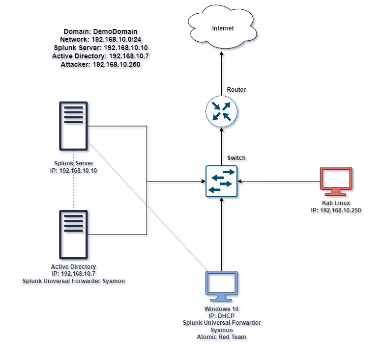

# Active Directory Project
[wip]
## Objective
[wip] <br>
 <br>
*Ref 1. Active Directory Lab Diagram*
## Skills Learned
[wip]
## Tools Used
[wip]

# Steps
## Part 1 - VM Installation
### *1. Install Oracle VM VirtualBox Manager*
Navigate to https://www.virtualbox.org/, download the compatible version, and install it with dependencies.
### *2. Install Windows 10*
Visit https://www.microsoft.com/en-ca/software-download/windows10, get "Create Windows 10 installation media", click "Download tool now", choose "Create installation media (USB flash drive, DVD, or ISO file) for another PC", then select "ISO file" and save it. In Oracle VM VirtualBox Manager, click "Add" to create a new VM, name it, choose the previously downloaded Windows 10 ISO, select 4096MB RAM, 1 CPU, 50GB virtual disk, and finish. Start the VM, follow the installation prompts, select "Custom: Install Windows only (advanced)", and let Windows 10 install.
### *3. Install Kali Linux*
Get Kali Linux from https://www.kali.org/, download the VM version, and also download/install 7-zip from https://www.7-zip.org/. Extract Kali Linux via 7-zip, import it into Oracle VM VirtualBox Manager, and start the VM. 
### *4. Install Windows Server*
Download Windows Server 2022 ISO from https://www.microsoft.com/en-us/evalcenter/evaluate-windows-server-2022, fill out the form, download "64-bit edition", create a new VM in Oracle VM VirtualBox Manager with the ISO, 4096MB RAM, 1 CPU, 50GB virtual disk, and finish. Start the VM, select "Install now", choose "Windows Server 2022 Standard Evaluation (Desktop Experience)", customize settings, create a password, and finish.
### *5. Install Splunk Server*
Navigate to https://ubuntu.com/server. In products, Ubuntu Server, download Ubuntu Server, download Ubuntu Server. This lab uses version 22.04.4 LTS. Create a new VM in Oracle VM VirtualBox Manager with the ISO, 8192MB RAM, 2 CPUs, 100GB virtual disk, and finish. Start the VM, select "Try or Install Ubuntu Server", continue through a series of "Done" and "Continue", then fill out the form before continuing the installation. Finally, reboot. Error messages are *expected*. After rebooting, login and run `sudo apt-get update && sudo apt-get upgrade -y`. After this completes, hit "Enter".
### *Summary*
You should now have Oracle VM VirtualBox Manager installed with four VMs running Windows 10, Kali Linux, Windows Server, and Splunk Server.

## Part 2
### *1. Setup Communications*
Navigate to Tools > Network > NAT Networks > Create. Provide a name and IPv4 Prefix (in this lab, we will use 192.168.10.0/24), then apply. Navigate to each VM > Settings > Network, change "Attached to: *NAT Network*" and assign the name to the NAT Network you just created. Run the Splunk VM and type `sudo nano /etc/netplan/00-installer-config.yaml`. You should modify and save to look like this: <br>
````
network: 
  ethernet:
    enp0s3:
      dhcp4: no
      addresses: [192.168.10.10/24]
      nameservers:
          addresses: [8.8.8.8]
      routes:
          - to: default
            via: 192.168.10.1
  version: 2
````
Then run `sudo netplan apply` to make changes. Now run `ip a`, you should see the IP address set to 192.168.10.10/24. Verify connecting by running `ping google.com`.
### *2. Install Splunk*
Navigate to https://www.splunk.com/ and download a free trial of Splunk Enterprise for Linux (.deb). Navigate back to Splunk and run `sudo apt-get install virtualbox-guest-additions-iso`. <br><br> Now navigate to Devices > Shared Folders > Shared Folders Settings > Create new Shared Folder. Navigate to the directory where you installed Splunk, check all three boxes, and continue. <br><br> Reboot the virtual machine with `sudo reboot`. Run `sudo apt-get install virtualbox-guest-utils` then reboot once more, and then `sudo adduser <your username> vboxsf`. Run `mkdir share` to create a new directory called "share". <br><br> Now run `sudo mount -t vboxsf -o uid=1000,gid=1000 <directory name where .deb file is located> share/`. <br><br> Verify completion with `ls -la`, "Share" should be highlighted. Navigate to the share directory using `cd share/` and run `ls -la` once more to view all the files listed in that directory. Install splunk by running `sudo dpkg -i splu<hit tab to auto-complete>` <br><br>
Navigate via `cd /opt/splunk/` and run `ls -la`. Change into the user Splunk by running `sudo -u splunk bash`. Run `cd bin/`. Run `./start splunk`, to continue press `q` followed by `y` and [ENTER]. <br><br>
To finalize this step, `exit`, `cd bin`, and finally, `sudo ./splunk enable boot-start -user splunk`. This will allow Splunk to start on boot as the user Splunk.
### *3. Configure Windows Machine*
In the Start Menu search for "About" > Rename this PC. Rename it to whatever you'd like, in this lab, I will name it "target-PC". Restart the system. Open the Command Prompt run `ipconfig` and view the current IPv4 Address. Navigate to the network icon at the bottom right of the window. Right click > Open Network & Internet Settings > Change adapter options > Right click the adapter > Properties > Double click on "Internet Protocol Version 4 (TCP/IPv4) Properties > Select Use the following IP address. Set IP Address to 192.168.10.100, Subnet mask to 255.255.255.0, Default gateway to 192.168.10.1, and lastly the Preferred DNS server to 8.8.8.8. Running `ipconfig` again should showcase the new IP address.<br><br> If your Splunk server is running, you can visit it via the browser on your target machine's browser by typing `192.168.10.10:8000` in as the URL. In the target machine visit https://www.splunk.com/ and navigate to Products >  Free Trials & Downloads > Universal Forwarder > Get my free download and download the correct version for your target machine. Double-click the installed MSI file, set up basic information but don't create a password. Skip deployment server, but for Receiving Indexer set the IP/port to 192.168.10.10:9997 and install.<br><br>Now install Sysmon by navigating to https://learn.microsoft.com/en-us/sysinternals/downloads/sysmon. Next, navigate to https://github.com/olafhartong/sysmon-modular scroll down and select sysmonconfig.xml. Click "raw", and save the file. Extract the sysmon file, copy URL of the extracted directory, and open Powershell as administrator, and navigate to that directory. Run `.\Sysmon64.exe -i ..\sysmonconfig.xml`, then click agree.<br><br>Now for the most important step, navigate to File Explorer> Local Disk (C:) > Program Files > SplunkUniversalForwarder > etc > system > local. Open Notepad as administrator and enter the following
````
[WinEventLog://Application]
index = endpoint
disabled = false

[WinEventLog://Security]
index = endpoint
disabled = false

[WinEventLog://System]
index = endpoint
disabled = false

[WinEventLog://Microsoft-Windows-Sysmon/Operational]
index = endpoint
disabled = false
renderXml = true
source = XmlWinEventLog:Microsoft-Windows-Sysmon/Operational
````
Save this file as all file types in the local folder accessed previously as "inputs.conf".<br><br>Open Services as administrator, navigate and double click SplunkForwarder, log on, and check Local System Account. Right-click Splunk Forwarder, and restart. Now, navigate to `192.168.10.10:8000` and login. Navigate to Settings > Indexes > New Index > name it "endpoint" > Save. Now navigate Settings > Forwarding & receiving > Configure receiving > New Receiving Port > Set port to 9997. Now navigate Apps > Search & Reporting and search for "index=endpoint". 
### *4. Configure Windows Server*
In the Start Menu search for "About" > Rename this PC. Rename it to whatever you'd like, in this lab, I will name it "ADDC01". Restart the system. Open the Command Prompt run `ipconfig` and view the current IPv4 Address. Navigate to the network icon at the bottom right of the window. Right click > Open Network & Internet Settings > Change adapter options > Right click the adapter > Properties > Double click on "Internet Protocol Version 4 (TCP/IPv4) Properties > Select Use the following IP address. Set IP Address to 192.168.10.7, Subnet mask to 255.255.255.0, Default gateway to 192.168.10.1, and lastly the Preferred DNS server to 8.8.8.8. Running `ipconfig` again should showcase the new IP address.<br><br> If your Splunk server is running, you can visit it via the browser on your target machine's browser by typing `192.168.10.10:8000` in as the URL. In the target machine visit https://www.splunk.com/ and navigate to Products >  Free Trials & Downloads > Universal Forwarder > Get my free download and download the correct version for your target machine. Double-click the installed MSI file, set up basic information but don't create a password. Skip deployment server, but for Receiving Indexer set the IP/port to 192.168.10.10:9997 and install.<br><br>Now install Sysmon by navigating to https://learn.microsoft.com/en-us/sysinternals/downloads/sysmon. Next, navigate to https://github.com/olafhartong/sysmon-modular scroll down and select sysmonconfig.xml. Click "raw", and save the file. Extract the sysmon file, copy URL of the extracted directory, and open Powershell as administrator, and navigate to that directory. Run `.\Sysmon64.exe -i ..\sysmonconfig.xml`, then click agree.<br><br>Now for the most important step, navigate to File Explorer> Local Disk (C:) > Program Files > SplunkUniversalForwarder > etc > system > local. Open Notepad as administrator and enter the following
````
[WinEventLog://Application]
index = endpoint
disabled = false

[WinEventLog://Security]
index = endpoint
disabled = false

[WinEventLog://System]
index = endpoint
disabled = false

[WinEventLog://Microsoft-Windows-Sysmon/Operational]
index = endpoint
disabled = false
renderXml = true
source = XmlWinEventLog:Microsoft-Windows-Sysmon/Operational
````
Save this file as all file types in the local folder accessed previously as "inputs.conf".<br><br>Open Services as administrator, navigate and double click SplunkForwarder, log on, and check Local System Account. Right-click Splunk Forwarder, and restart. Now, navigate to `192.168.10.10:8000` and login. Navigate to Settings > Indexes > New Index > name it "endpoint" > Save. Now navigate Settings > Forwarding & receiving > Configure receiving > New Receiving Port > Set port to 9997. Now navigate Apps > Search & Reporting and search for "index=endpoint". 

### *Summary*
When viewing your Splunk server from either of your Windows machines, you should be able to see under "Selected fields" > "Host" two Values (your VMs) TARGET-PC and ADDC01.

